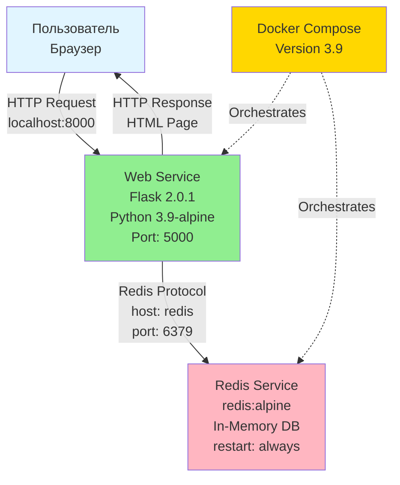

# Лабораторная работа №6. Проектирование и реализация комплексной микросервисной системы для автоматизации бизнес-процесса с использованием Docker Compose.

**Цель работы:** научиться разворачивать многокомпонентные приложения, понимать взаимодействие между контейнерами (Business Logic + Database) и модифицировать параметры системы под конкретные бизнес-задачи.

**Технические требования:**
*   **ОС:** Ubuntu 20.04 LTS (рекомендуется 8 ГБ ОЗУ).
*   **ПО:** Docker Engine, Docker Compose V2 (команды выполняются через пробел: `docker compose`).

---

## Часть 1. Теоретическая справка

1.  **Микросервисная архитектура** — подход к разработке, при котором приложение разбивается на независимые компоненты (сервисы), каждый из которых выполняет свою бизнес-функцию и общается с другими по сети.
2.  **Образ (Image)** — неизменяемый шаблон (файл), из которого запускается приложение. Содержит код, библиотеки и среду выполнения.
3.  **Контейнер (Container)** — запущенный экземпляр образа. Это изолированный процесс, в котором работает ваша программа.
4.  **Docker Compose** — инструмент для описания и запуска многоконтейнерных приложений. Конфигурация описывается в YAML-файле, что позволяет поднять всю инфраструктуру одной командой.

---

## Часть 2. Практическая работа (Базовый кейс)

### 2.1. Бизнес-кейс. "Счетчик посещений стенда"
**Задача.** Для маркетингового отдела необходимо реализовать счетчик посетителей на выставке. Данные должны сохраняться в базе данных, чтобы при сбое приложения статистика не терялась.
**Архитектура:**
*   `web`: Python-приложение (Flask), принимающее запросы.
*   `redis`: In-memory база данных для быстрого хранения счетчика.

### 2.2. Ход работы

1.  **Подготовка:**
    Откройте терминал, создайте папку и перейдите в нее:
    ```bash
    mkdir lab6_business && cd lab6_business
    ```

2.  **Файл зависимостей (`requirements.txt`):**
    Создайте файл с библиотеками:
    ```bash
    nano requirements.txt
    ```
    Содержимое:
    ```text
    Flask==2.0.1
    Werkzeug==2.3.7
    redis==4.6.0 
    ```

3.  **Код приложения (`app.py`):**
    Создайте файл бизнес-логики:
    ```bash
    nano app.py
    ```
    Содержимое:
    ```python
    import time
    import redis
    from flask import Flask

    app = Flask(__name__)
    # 'redis' - это имя хоста (контейнера), которое мы укажем в docker-compose
    cache = redis.Redis(host='redis', port=6379)

    def get_hit_count():
        retries = 5
        while True:
            try:
                return cache.incr('hits')
            except redis.exceptions.ConnectionError as exc:
                if retries == 0:
                    raise exc
                retries -= 1
                time.sleep(0.5)

    @app.route('/')
    def hello():
        count = get_hit_count()
        return '<h1 style="color:green">Бизнес-стенд "Инновации"</h1><p>Посетителей сегодня: <strong>{}</strong></p>'.format(count)

    if __name__ == "__main__":
        app.run(host="0.0.0.0", debug=True)
    ```

4.  **Dockerfile (`Dockerfile`):**
    Инструкция по сборке образа:
    ```bash
    nano Dockerfile
    ```
    Содержимое:
    ```dockerfile
    FROM python:3.9-alpine
    WORKDIR /code
    COPY requirements.txt requirements.txt
    RUN pip install -r requirements.txt
    COPY . .
    CMD ["python", "app.py"]
    ```

5.  **Оркестрация (`docker-compose.yml`):**
    Файл связки сервисов:
    ```bash
    nano docker-compose.yml
    ```
    Содержимое:
    ```yaml
    version: "3.9"
    services:
      web:
        build: .
        ports:
          - "8000:5000"
        depends_on:
          - redis
      redis:
        image: "redis:alpine"
    ```

6.  **Запуск и проверка:**
    ```bash
    docker compose up -d
    ```
    Откройте браузер по адресу `http://localhost:8000`. Обновите страницу несколько раз — счетчик должен расти.

---

## Часть 3. Индивидуальные задания

**Инструкция.** Выберите свой вариант. В каждом варианте необходимо выполнить **три изменения**:
1.  **Бизнес-логика.** Правки в `app.py` (изменяет суть работы приложения).
2.  **Инфраструктура.** Правки в `docker-compose.yml` (настройки сети, портов, политик).
3.  **Среда сборки.** Правки в `Dockerfile` (базовые образы, метаданные).

После внесения изменений необходимо пересобрать проект командой:
`docker compose up -d --build`

### Таблица вариантов

| Вариант | Задача 1. Бизнес-логика (`app.py`) | Задача 2. Инфраструктура (`docker-compose.yml`) | Задача 3. Среда сборки (`Dockerfile`) |
| :--- | :--- | :--- | :--- |
| **1** | Изменить заголовок на "Учет билетов" и цвет текста на синий. | Сменить внешний порт с 8000 на **8081**. | Добавить метку `LABEL maintainer="ВашеИмя"`. |
| **2** | Реализовать обратный отсчет (склад). Использовать `cache.decr` вместо `incr`. | Добавить политику перезапуска `restart: always` для веб-сервиса. | Сменить базовый образ на `python:3.9-slim`. |
| **3** | Увеличивать счетчик сразу на 10 (шаг=10). Тема: "Начисление баллов". | Задать контейнеру Redis имя `container_name: my-business-db`. | Изменить рабочую директорию внутри на `/app`. |
| **4** | Выводить результат умноженный на 100. Тема: "Прибыль в рублях". | Ограничить память для Redis (если возможно) или добавить `restart: on-failure`. | Добавить установку curl: `RUN apk add curl`. |
| **5** | Добавить в вывод HTML фразу "Версия системы: v2.0". | Изменить маппинг портов на **5050:5000**. | Использовать образ Python версии `3.10-alpine`. |
| **6** | Перевести интерфейс на английский: "Visitors count: X". | Переименовать сервис `web` в `frontend`. | Добавить переменную окружения `ENV TEAM="Sales"`. |
| **7** | Сделать текст счетчика заголовком H1 (очень крупно). | Изменить внешний порт на **9000**. | Добавить копирование файла Readme (создать пустой) внутрь образа. |
| **8** | Добавить предупреждение "Тестовый режим" красным цветом. | Скрыть Redis из внешнего мира (убрать секцию ports у redis). | Сменить базовый образ на `python:3.8-alpine`. |
| **9** | Тема "Очередь заказов". Текст: "Заказ № X принят". | Изменить имя образа Redis на `redis:6.2`. | Добавить команду `RUN echo "Build complete"`. |
| **10** | Добавить текущее время сервера в вывод (модуль datetime). | Настроить `stop_grace_period: 10s` для веб-сервиса. | Использовать `WORKDIR /server`. |
| **11** | Реализовать "Сброс счетчика". Если число > 10, сбрасывать в 0 (логика в Python). | Изменить внешний порт на **3000**. | Добавить комментарий в Dockerfile о назначении файла. |
| **12** | Тема "Голосование". Текст: "Голосов за кандидата А: X". | Добавить зависимость `depends_on`. | Добавить `LABEL version="1.0"`. |
| **13** | Выводить "Ошибка", если Redis недоступен (try/except с другим текстом). | Пробросить переменную среды `ENVIRONMENT=DEV` через compose. | Сменить образ на `python:3.11-rc-alpine`. |
| **14** | Тема "Свободные места". Начать с 1000 и уменьшать. | Сменить внешний порт на **8888**. | Удалить кэш pip в одной строке с установкой (`--no-cache-dir`). |
| **15** | Добавить логирование в консоль `print("New request")`. | Изменить имя контейнера веб-сервиса на `biz-app`. | Изменить базовый образ на `python:3.7-alpine`. |
| **16** | Тема "Сбор пожертвований". Счетчик + знак $. | Использовать сеть `network_mode: bridge`. | Добавить `ENV APP_PORT=5000`. |
| **17** | Изменить цвет фона страницы (тег body style). | Изменить версию compose файла на "3.8". | Добавить создание пустой папки `RUN mkdir /logs`. |
| **18** | Тема "Количество ошибок". Цвет красный. | Пробросить порт Redis наружу как **6380:6379**. | Использовать `COPY . /app` вместо `/code`. |
| **19** | Выводить число в квадрате (count * count). | Добавить `dns: 8.8.8.8` для веб-сервиса. | Добавить `LABEL description="My Lab"`. |
| **20** | Тема "Дни до дедлайна". Текст соответствующий. | Изменить порт на **7070**. | Обновить pip перед установкой (`RUN pip install --upgrade pip`). |
| **21** | Добавить HTML-футер "ООО Ромашка, 2024". | Переименовать сервис `redis` в `cache` (потребует правки app.py host='cache'). | Сменить образ на `python:alpine3.15`. |
| **22** | Тема "Температура". Текст "Градусов: X". | Добавить volume для Redis (хотя бы пустой bind). | Добавить `ENV AUTHOR="Student"`. |
| **23** | Условный вывод: если >5, писать "Много", иначе "Мало". | Изменить внешний порт на **80**. | Использовать `CMD ["python3", "app.py"]`. |
| **24** | Тема "Проданные авто". Добавить картинку (ссылкой img src). | Добавить `restart: unless-stopped`. | Добавить `RUN apk update`. |
| **25** | Дублировать вывод числа дважды. | Изменить порт на **4000**. | Сменить workdir на `/usr/src/app`. |
| **26** | Тема "ID сессии". Текст: "Session #X started". | Убрать `depends_on` и проверить работу (эксперимент). Вернуть обратно. | Добавить `EXPOSE 5000` в Dockerfile. |
| **27** | Выводить текст жирным курсивом. | Добавить healthcheck (простой) для Redis в compose. | Сменить базовый образ на `python:3.9`. |
| **28** | Тема "Лайки". Символ сердечка + счетчик. | Изменить порт на **8008**. | Добавить `LABEL tier="backend"`. |
| **29** | Сделать счетчик кратным 5 (умножать на 5). | Явно задать сеть `networks: - my-net`. | Добавить `RUN pip install flask redis` (без requirements.txt, удалить его копирование). |
| **30** | Тема "Выданные пропуска". Цвет серый. | Изменить имя контейнера Redis на `db-store`. | Сменить образ Python на версию `buster` (slim-buster). |
| **31** | Добавить ссылку "Обновить" (a href='/'). | Пробросить порт **8085:5000**. | Добавить переменную `ENV DEBUG=1`. |
| **32** | Выводить "Первый", "Второй" для цифр 1 и 2. | Использовать `redis:latest` вместо alpine. | Использовать `ENTRYPOINT` вместо `CMD` (эксперимент). |
| **33** | Тема "Загрузка CPU". Имитация (просто число %). | Добавить `tty: true` для веб-контейнера. | Создать пользователя `RUN adduser -D myuser`. |
| **34** | Выводить случайное число + счетчик (import random). | Изменить внешний порт на **1234**. | Добавить `LABEL release-date="2025"`. |
| **35** | Тема "Счастливый посетитель". Если кратно 7 - поздравление. | Добавить `restart: always` для Redis. | Установить конкретную версию Flask в requirements (Flask==2.0.1). |

---

## Часть 4. Представление результатов и критерии оценки

### 4.1. Формат сдачи
Результат работы оформляется в виде репозитория на **GitHub** или **GitVerse**. Ссылка на репозиторий загружается в **Moodle**.

**Структура репозитория:**
1.  Файлы проекта (`app.py`, `Dockerfile`, `docker-compose.yml`, `requirements.txt`).
2.  Файл `README.md`, содержащий:
    *   ФИО студента, номер группы, номер варианта.
    *   Описание внесенных изменений по трем подзадачам.
    *   **Скриншоты**:
        1.  Терминал с запущенной командой `docker compose ps` (показывает работающие контейнеры и порты).
        2.  Браузер с открытой страницей `localhost:PORT`, где видна реализованная бизнес-логика.

### 4.2. Критерии оценки (Максимум 10 баллов)

| Баллы | Критерий | Описание |
| :--- | :--- | :--- |
| **3 балла** | Базовая работоспособность | Приложение запускается, docker compose up работает без ошибок, счетчик крутится. |
| **2 балла** | Задача 1 (Бизнес-логика) | Код Python изменен согласно варианту, изменения видны в браузере. |
| **2 балла** | Задача 2 (Инфраструктура) | Конфигурация docker-compose изменена (порт, имя, политики), изменения подтверждены скриншотом `ps`. |
| **1 балл** | Задача 3 (Сборка) | Dockerfile изменен корректно, билд проходит успешно. |
| **2 балла** | Оформление (Repo/Readme) | Репозиторий создан корректно, README.md содержит описание и скриншоты, ссылка открывается. |


# Лабораторная работа 6 (Вариант 35)

## Описание проекта

Данный проект реализует микросервисную систему для подсчета посетителей с использованием Flask и Redis. Особенностью варианта 35 является реализация функции **"Счастливый посетитель"**: каждый седьмой посетитель (кратный 7) получает специальное поздравление зеленым цветом.

### Бизнес-кейс. "Счастливый посетитель"

Система ведет подсчет посетителей и при достижении числа, кратного 7, выводит специальное поздравление "Поздравляем! Вы счастливчик!" зеленым цветом. В остальных случаях отображается стандартное сообщение "Посетитель номер: X".

## Архитектура

Система построена на микросервисной архитектуре с использованием Docker Compose для оркестрации контейнеров. Ниже представлена диаграмма архитектуры:



### Компоненты системы

- **Web Service (Flask)**: 
  - Принимает HTTP-запросы от пользователей
  - Реализует бизнес-логику подсчета посетителей
  - Проверяет кратность числа 7 для функции "Счастливый посетитель"
  - Подключается к Redis для хранения счетчика
  
- **Redis Service**: 
  - Хранит счетчик посетителей в памяти
  - Обеспечивает быстрый доступ к данным
  - Настроен с политикой `restart: always` для высокой доступности
  
- **Docker Compose**: 
  - Оркестрирует запуск и взаимодействие сервисов
  - Управляет сетевой связностью между контейнерами
  - Обеспечивает зависимость `web` от `redis`

## Стек технологий

### Backend
- **Python 3.9** — язык программирования
- **Flask 2.0.1** — веб-фреймворк для создания REST API
- **Redis 4.6.0** — клиент для работы с Redis

### Инфраструктура и DevOps
- **Docker** — контейнеризация приложений
- **Docker Compose 3.9** — оркестрация многоконтейнерных приложений
- **Alpine Linux** — легковесный базовый образ для контейнеров

### База данных
- **Redis (alpine)** — in-memory хранилище данных (key-value store)

### Сетевые протоколы
- **HTTP/1.1** — протокол для взаимодействия клиента и веб-сервиса
- **Redis Protocol** — протокол для взаимодействия Flask и Redis

## Внесенные изменения по варианту 35

### 1. Бизнес-логика (`app.py`)
- Реализована проверка кратности числа посетителей 7
- При `count % 7 == 0` выводится поздравление зеленым цветом
- В остальных случаях - стандартное сообщение

### 2. Инфраструктура (`docker-compose.yml`)
- Добавлена политика перезапуска `restart: always` для сервиса Redis
- Это обеспечивает автоматический перезапуск Redis при сбоях

### 3. Среда сборки (`requirements.txt` и `Dockerfile`)
- Зафиксирована строгая версия Flask==2.0.1
- Указана стабильная версия redis==4.6.0

## Инструкция по запуску

### Предварительные требования
- Docker Engine установлен и запущен
- Docker Compose V2 доступен (команда `docker compose`)

### Шаги запуска

1. **Сборка и запуск контейнеров:**
   ```bash
   docker compose up -d --build
   ```

2. **Проверка статуса контейнеров:**
   ```bash
   docker compose ps
   ```

3. **Просмотр логов (опционально):**
   ```bash
   docker compose logs -f
   ```

4. **Открытие приложения:**
   Откройте браузер и перейдите по адресу: `http://localhost:8000`

5. **Тестирование логики "Счастливого посетителя":**
   - Обновите страницу несколько раз (F5 или Ctrl+R)
   - При достижении чисел 7, 14, 21, 28 и т.д. вы увидите зеленое поздравление

### Остановка контейнеров

```bash
docker compose down
```

## Проверка работоспособности

### 1. Проверка запущенных контейнеров
```bash
docker compose ps
```
Должны быть видны два контейнера: `web` и `redis`, оба в статусе "Up".

### 2. Проверка версии Flask
Для проверки, что установлена именно версия Flask 2.0.1:
```bash
docker compose exec web pip show flask
```
В выводе должна быть строка `Version: 2.0.1`.

### 3. Ручное тестирование логики "Счастливого посетителя"
1. Откройте браузер: `http://localhost:8000`
2. Обновите страницу 7 раз (F5)
3. На 7-м обновлении должно появиться зеленое сообщение "Поздравляем! Вы счастливчик!"
4. Продолжите обновлять - на 14-м, 21-м и т.д. также будет поздравление

### 4. Проверка работы Redis
Для проверки подключения к Redis можно выполнить:
```bash
docker compose exec redis redis-cli GET hits
```
Команда покажет текущее значение счетчика.

## Структура проекта

```
.
├── app.py                 # Основное Flask-приложение
├── Dockerfile             # Инструкции для сборки образа
├── docker-compose.yml     # Конфигурация оркестрации сервисов
├── requirements.txt       # Зависимости Python
├── README.md             # Документация проекта
└── lw_06.md             # Задание лабораторной работы
```

## Пошаговая инструкция по проверке работоспособности системы

### Шаг 1. Сборка и запуск контейнеров

Выполните команду для сборки и запуска контейнеров (используя синтаксис Docker Compose V2):

```bash
docker compose up -d --build
```

Эта команда:
- Соберет образ для веб-сервиса из Dockerfile
- Загрузит образ Redis:alpine
- Запустит оба контейнера в фоновом режиме (`-d`)

**Ожидаемый результат:** Вы увидите процесс сборки образа и запуска контейнеров. В конце должны появиться сообщения о создании и запуске контейнеров.

### Шаг 2. Проверка списка запущенных контейнеров

Выполните команду для просмотра статуса контейнеров:

```bash
docker compose ps
```

**Ожидаемый вывод:**
- Контейнер `web` — статус "Up", порты "0.0.0.0:8000->5000/tcp"
- Контейнер `redis` — статус "Up"

Оба контейнера должны быть в состоянии "Up" и работать корректно.

### Шаг 3. Ручное тестирование логики "Счастливого посетителя"

1. **Откройте браузер** и перейдите по адресу: `http://localhost:8000`

2. **Обновите страницу 7 раз** (используйте F5 или Ctrl+R):
   - **Первые 6 обновлений:** Вы увидите обычные сообщения:
     - "Посетитель номер: 1"
     - "Посетитель номер: 2"
     - "Посетитель номер: 3"
     - и так далее до "Посетитель номер: 6"
   
   - **На 7-м обновлении:** Должно появиться зеленое сообщение:
     - "Поздравляем! Вы счастливчик!"
     - "Вы посетитель номер: 7"
   
   - **На 8-м обновлении:** Снова обычное сообщение "Посетитель номер: 8"
   
   - **На 14-м, 21-м, 28-м и т.д. обновлениях:** Снова будет появляться поздравление

3. **Проверьте визуально:** Зеленое поздравление должно быть четко видно и отличаться от обычного сообщения.

### Шаг 4. Проверка версии Flask внутри контейнера

Для проверки, что установлена именно зафиксированная версия Flask 2.0.1, выполните:

```bash
docker compose exec web pip show flask
```

**Ожидаемый вывод:**
```
Name: Flask
Version: 2.0.1
...
```

В строке `Version:` должно быть указано `2.0.1` — это подтверждает, что установлена правильная версия.

### Дополнительные команды для проверки

**Просмотр логов приложения:**
```bash
docker compose logs web
```
Покажет все логи веб-сервиса, включая сообщения Flask.

**Просмотр логов Redis:**
```bash
docker compose logs redis
```

**Просмотр логов всех сервисов в реальном времени:**
```bash
docker compose logs -f
```

**Проверка значения счетчика в Redis:**
```bash
docker compose exec redis redis-cli GET hits
```
Команда покажет текущее значение счетчика посетителей, хранящееся в Redis.

**Остановка контейнеров:**
```bash
docker compose down
```

**Перезапуск после изменений в коде:**
```bash
docker compose up -d --build
```

### Устранение возможных проблем

**Если контейнеры не запускаются:**
- Проверьте, что Docker Engine запущен: `docker ps`
- Проверьте логи: `docker compose logs`
- Убедитесь, что порт 8000 не занят другим приложением

**Если приложение не отвечает:**
- Проверьте статус контейнеров: `docker compose ps`
- Убедитесь, что оба контейнера в статусе "Up"
- Проверьте логи веб-сервиса: `docker compose logs web`

**Если Redis недоступен:**
- Проверьте логи Redis: `docker compose logs redis`
- Убедитесь, что политика `restart: always` работает корректно

