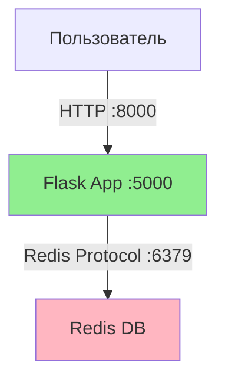

# Лабораторная работа №05. Проектирование и реализация комплексной микросервисной системы для автоматизации бизнес-процесса с использованием Docker Compose

### 🎯 Цель работы
Научиться разворачивать многокомпонентные приложения, понимать принципы взаимодействия между контейнерами (Business Logic + Database) и модифицировать параметры системы под конкретные бизнес-задачи с использованием Docker Compose.

### 🛠 Инструменты и технические требования
*   **Операционная система:** Ubuntu 20.04 LTS (рекомендуется) или любая ОС с поддержкой Docker.
*   **Программное обеспечение:**
    *   Docker Engine.
    *   Docker Compose V2 (синтаксис `docker compose`).
    *   Python 3.9+.

---

### 📚 Теоретическая часть

1.  **Микросервисная архитектура** — подход к разработке ПО, при котором приложение разбивается на небольшие независимые компоненты (сервисы), каждый из которых выполняется в собственном процессе и общается с остальными по сети (обычно через HTTP API).
2.  **Образ (Image)** — неизменяемый шаблон, содержащий исходный код, библиотеки, зависимости и инструменты, необходимые для запуска приложения.
3.  **Контейнер (Container)** — запущенный экземпляр образа. Это изолированная среда выполнения процесса.
4.  **Docker Compose** — инструмент для определения и запуска многоконтейнерных приложений Docker. Конфигурация сервисов, сетей и томов описывается в одном файле `docker-compose.yml`.

---

### 💻 Практическая часть (Базовый кейс)

#### Бизнес-кейс. "Счетчик посещений стенда"
Необходимо реализовать веб-приложение для маркетингового отдела, которое считает количество посетителей. Данные должны сохраняться в базе данных (Redis), чтобы статистика не терялась при перезапуске веб-сервера.

**Архитектура:**
*   **web:** Python-приложение на Flask.
*   **redis:** In-memory хранилище данных.

#### Ход работы

1.  **Подготовка рабочего пространства:**
    ```bash
    mkdir lab6_business && cd lab6_business
    ```

2.  **Создание файла зависимостей (`requirements.txt`):**
    ```text
    Flask==2.0.1
    Werkzeug==2.3.7
    redis==4.6.0
    ```

3.  **Реализация бизнес-логики (`app.py`):**
    ```python
    import time
    import redis
    from flask import Flask

    app = Flask(__name__)
    # Подключение к контейнеру с именем 'redis'
    cache = redis.Redis(host='redis', port=6379)

    def get_hit_count():
        retries = 5
        while True:
            try:
                return cache.incr('hits')
            except redis.exceptions.ConnectionError as exc:
                if retries == 0:
                    raise exc
                retries -= 1
                time.sleep(0.5)

    @app.route('/')
    def hello():
        count = get_hit_count()
        return '<h1 style="color:green">Бизнес-стенд "Инновации"</h1><p>Посетителей сегодня: <strong>{}</strong></p>'.format(count)

    if __name__ == "__main__":
        app.run(host="0.0.0.0", debug=True)
    ```

4.  **Создание Dockerfile:**
    ```dockerfile
    FROM python:3.9-alpine
    WORKDIR /code
    COPY requirements.txt requirements.txt
    RUN pip install -r requirements.txt
    COPY . .
    CMD ["python", "app.py"]
    ```

5.  **Оркестрация (`docker-compose.yml`):**
    ```yaml
    version: "3.9"
    services:
      web:
        build: .
        ports:
          - "8000:5000"
        depends_on:
          - redis
      redis:
        image: "redis:alpine"
    ```

6.  **Запуск и проверка:**
    ```bash
    docker compose up -d
    ```
    Перейдите в браузере по адресу `http://localhost:8000`.

---

### 📝 Индивидуальные задания

В каждом варианте необходимо выполнить три модификации базового проекта:
1.  **Бизнес-логика (`app.py`).** Изменить алгоритм работы приложения согласно варианту.
2.  **Инфраструктура (`docker-compose.yml`).** Изменить настройки сети, портов или политик перезапуска.
3.  **Среда сборки (`Dockerfile`).** Изменить базовый образ или зафиксировать версии зависимостей.

После внесения изменений выполните пересборку:
```bash
docker compose up -d --build
```

[🔗 Перейти к списку вариантов заданий на образовательном портале](https://envlab.ru/mod/assign/view.php?id=1022&forceview=1)

---

### 💡 Пример выполнения задания (Вариант 35)

**Задача.** Реализовать функцию "Счастливый посетитель" (каждый 7-й получает поздравление), зафиксировать версии библиотек и настроить перезапуск БД.

#### 1. Изменения в коде
В файл `app.py` добавлена проверка кратности:
```python
@app.route('/')
def hello():
    count = get_hit_count()
    if count % 7 == 0:
        return '<h1 style="color:green">Поздравляем! Вы счастливчик!</h1><p>Вы посетитель номер: <strong>{}</strong></p>'.format(count)
    return '<h1>Бизнес-стенд</h1><p>Посетитель номер: {}</p>'.format(count)
```

#### 2. Изменения в инфраструктуре
В `docker-compose.yml` добавлена политика `restart: always` для Redis:
```yaml
  redis:
    image: "redis:alpine"
    restart: always
```

#### 3. Архитектура решения



#### 4. Проверка работоспособности
1.  **Запуск.** `docker compose up -d --build`
2.  **Проверка процесса.** `docker compose ps`
3.  **Тест.** При обновлении страницы 7 раз появляется зеленое сообщение "Вы счастливчик!".
4.  **Проверка версии.** `docker compose exec web pip show flask` (версия 2.0.1).

---

### 📄 Требования к отчету

Отчет предоставляется в виде ссылки на репозиторий (GitHub/GitVerse), содержащий:
1.  **Файлы проекта:** `app.py`, `Dockerfile`, `docker-compose.yml`, `requirements.txt`.
2.  **README.md:**
    *   ФИО, группа, номер варианта.
    *   Описание внесенных изменений (по 3 пунктам).
    *   **Скриншоты:**
        *   Вывод команды `docker compose ps`.
        *   Окно браузера с демонстрацией реализованной бизнес-логики.

### 💯 Критерии оценки (макс. 10 баллов)

| Баллы | Критерии |
|:---:|---|
| **3** | **Базовая работоспособность:** Приложение запускается через docker compose, счетчик работает. |
| **2** | **Задача 1 (Логика):** Код Python изменен корректно, логика варианта реализована. |
| **2** | **Задача 2 (Инфраструктура):** Изменен `docker-compose.yml` (порты/политики), подтверждено скриншотом. |
| **1** | **Задача 3 (Сборка):** Dockerfile и requirements.txt настроены верно, сборка проходит без ошибок. |
| **2** | **Оформление:** Репозиторий структурирован, README содержит описание и скриншоты. |
