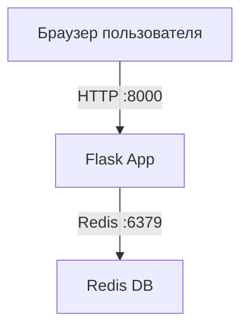

# Лабораторная работа №05. Проектирование и реализация комплексной микросервисной системы с использованием Docker Compose

## Цель работы

Научиться:

- запускать многоконтейнерные приложения;
- организовывать взаимодействие между сервисами;
- использовать Docker Compose для оркестрации;
- изменять бизнес-логику и инфраструктуру проекта;
- работать с Redis как с внешним сервисом хранения данных.

---

# Требования

## Операционная система

- Ubuntu 20.04 или новее;
- Windows/macOS с Docker Desktop.

## Необходимое ПО

Установить:

- Docker Engine
- Docker Compose V2
- Python 3.9+

Проверка установки:

```bash
docker --version
docker compose version
python3 --version
```

---

# 📚 Теоретические сведения

## Docker Image

Образ — шаблон приложения, содержащий:

- код;
- библиотеки;
- зависимости;
- настройки запуска.

---

## Container

Контейнер — запущенный экземпляр образа.

---

## Docker Compose

Позволяет запускать несколько контейнеров одной командой через файл:

```text
docker-compose.yml
```

---

## Redis

Redis — быстрое in-memory хранилище данных.

В лабораторной работе Redis хранит счетчик посещений.

---

# Практическая часть

# Бизнес-кейс

## «Счетчик посетителей стенда»

Необходимо создать веб-приложение:

- Flask отображает страницу;
- Redis хранит количество посещений;
- счетчик не сбрасывается при перезапуске web-сервиса.

---

# 🧱 Архитектура проекта


```mermaid
graph TB
    User[Браузер пользователя]
    Web[Flask App]
    Redis[Redis DB]

    User -->|HTTP :8000| Web
    Web -->|Redis :6379| Redis
```

---

# 📁 Шаг 1. Создание проекта

Создать рабочую папку:

```bash
mkdir lab5_business
cd lab5_business
```

---

# 📁 Шаг 2. Создание requirements.txt

Создать файл:

```bash
nano requirements.txt
```

Содержимое:

```text
Flask==2.0.1
Werkzeug==2.3.7
redis==4.6.0
```

Сохранение:

- `CTRL + O`
- `Enter`
- `CTRL + X`

---

# 📁 Шаг 3. Создание app.py

Создать файл:

```bash
nano app.py
```

Код приложения:

```python
import time
import redis
from flask import Flask

app = Flask(__name__)

cache = redis.Redis(host='redis', port=6379)

def get_hit_count():
    retries = 5

    while True:
        try:
            return cache.incr('hits')

        except redis.exceptions.ConnectionError as exc:
            if retries == 0:
                raise exc

            retries -= 1
            time.sleep(0.5)

@app.route('/')
def hello():
    count = get_hit_count()

    return '''
    <h1 style="color:green">
        Бизнес-стенд "Инновации"
    </h1>

    <p>
        Посетителей сегодня:
        <strong>{}</strong>
    </p>
    '''.format(count)

if __name__ == "__main__":
    app.run(host="0.0.0.0", debug=True)
```

---

# 📁 Шаг 4. Создание Dockerfile

Создать файл:

```bash
nano Dockerfile
```

Содержимое:

```dockerfile
FROM python:3.9-alpine

WORKDIR /code

COPY requirements.txt requirements.txt

RUN pip install -r requirements.txt

COPY . .

CMD ["python", "app.py"]
```

---

# 📁 Шаг 5. Создание docker-compose.yml

Создать файл:

```bash
nano docker-compose.yml
```

Содержимое:

```yaml
version: "3.9"

services:

  web:
    build: .

    ports:
      - "8000:5000"

    depends_on:
      - redis

  redis:
    image: redis:alpine
```

---

# 🚀 Шаг 6. Сборка и запуск проекта

Запуск контейнеров:

```bash
docker compose up -d --build
```

---

# 🔍 Шаг 7. Проверка работы

## Проверка контейнеров

```bash
docker compose ps
```

Ожидаемый результат:

- контейнер `web` имеет статус `running`;
- контейнер `redis` имеет статус `running`.

---

## Проверка в браузере

Открыть:

```text
http://localhost:8000
```

При обновлении страницы счетчик должен увеличиваться.

---

## Проверка Redis

Подключение:

```bash
docker compose exec redis redis-cli
```

Получить значение:

```bash
GET hits
```

Выход:

```bash
exit
```

---

## Просмотр логов

```bash
docker compose logs web
```

В реальном времени:

```bash
docker compose logs -f web
```

---

# 📝 Индивидуальное задание

Необходимо изменить:

| Компонент | Что изменить |
|---|---|
| `app.py` | бизнес-логику |
| `docker-compose.yml` | инфраструктуру |
| `Dockerfile` | среду сборки |

---

# 💡 Пример варианта

## Вариант 35

### Требуется:

- каждый 7-й посетитель получает поздравление;
- Redis автоматически перезапускается;
- версии библиотек фиксируются.

---

## Изменение app.py

```python
@app.route('/')
def hello():

    count = get_hit_count()

    if count % 7 == 0:
        return '''
        <h1 style="color:green">
            Поздравляем! Вы счастливчик!
        </h1>

        <p>
            Вы посетитель номер:
            <strong>{}</strong>
        </p>
        '''.format(count)

    return '''
    <h1>Бизнес-стенд</h1>

    <p>
        Посетитель номер: {}
    </p>
    '''.format(count)
```

---

## Изменение docker-compose.yml

```yaml
redis:
  image: redis:alpine
  restart: always
```

---

# 🔄 Пересборка проекта

После изменений выполнить:

```bash
docker compose down
docker compose up -d --build
```

---

# ✅ Проверка индивидуального задания

1. Открыть:

```text
http://localhost:8000
```

2. Обновить страницу несколько раз.

3. Проверить:

- счетчик увеличивается;
- на каждом 7-м посещении появляется сообщение;
- контейнеры работают корректно.

---

# 📦 Управление проектом

## Остановка контейнеров

```bash
docker compose stop
```

---

## Остановка и удаление

```bash
docker compose down
```

---

## Удаление volumes

```bash
docker compose down -v
```

---

## Полная очистка

```bash
docker compose down -v --rmi all
```

---

# 📄 Требования к отчету

В репозитории должны быть:

- `app.py`
- `Dockerfile`
- `docker-compose.yml`
- `requirements.txt`
- `README.md`

---

# README.md должен содержать

## Информацию о студенте

- ФИО;
- группа;
- номер варианта.

---

## Описание изменений

- изменения логики;
- изменения инфраструктуры;
- изменения Dockerfile.

---

## Скриншоты

- `docker compose ps`
- работа приложения в браузере
- результат индивидуального задания

---

# 💯 Критерии оценки

| Баллы | Критерий |
|---|---|
| 3 | Проект запускается |
| 2 | Реализована логика |
| 2 | Изменен compose |
| 1 | Dockerfile настроен |
| 2 | Корректный README и скриншоты |